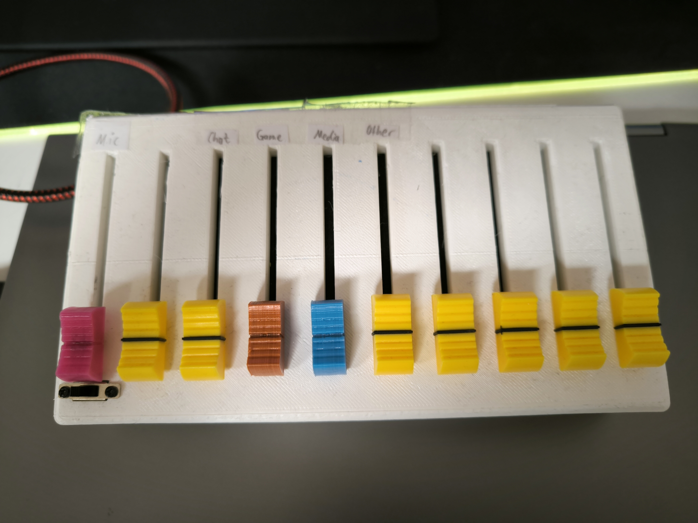
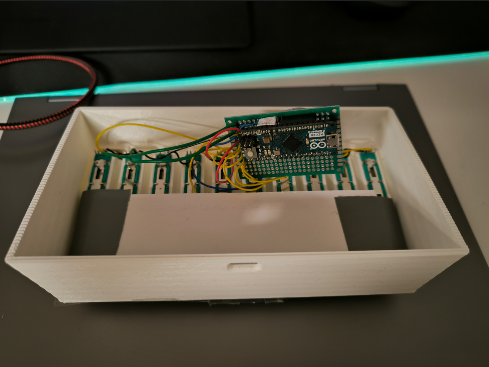

# steelseries-sonar-api

A python api for steelseries' sonar software. An advanced form of <a href="https://github.com/Mark7888/steelseries-sonar-py">Mark7888's sonar api<a> including the possibility to change audio devices and use a hardware controller to interface with sonar.

## Requirements
- Python 3.9 or above
- rtmidi (pip3 install rtmidi)
- Some kind of usb-midi controller capable of sending controlchange commands is required as a hardware interface.

The device changing function also works without this controller if you just want to use this as an inspiration. However I do not provide a version of the code without the controller implemented as this is the only reason this project exists.

## IMPORTANT 
This will ONLY work with streamer (for now) because I use streamer mode.

## Installation 
1. Create a new folder anywhere you want, it will later be filled with all the files.
2. Download Nirsoft's SoundVolumeView from <a href="https://www.nirsoft.net/utils/soundvolumeview-x64.zip">here<a> and place it into your folder. It should now look something like this:

   
4. Download this repo and unpack it somewhere else than this folder.
5. Copy the file 'dump_devices.bat' into the folder, like this:

   
6. Verify everything is working by running the file from step 5, it should create a new file called 'dump.txt':

   
7. You can now insert the files 'main.py', 'sonar.py' and 'devices.py' into your folder

## Configuration 

### Primary audio device
1. Open the windows 'Sound output' menu (CTRL+WIN+V) and check for the device you want to use. For me it would be 'Lautsprecher (Realtek(R) Audio)', note this.

   
3. Start SoundVolumeView.exe It will look like this:

   
5. Now check for the first part of your audio devices name ('Lautsprecher'). Look at the one with 'Device' and 'Render' in the following two collumns. The fourth column should include the second part of its name '(Realtek(R) Audio)'. (It is visible in the image from 2. near the bottom)
6. Piece these together like this: 'Lautsprecher,Device,Render,Realtek(R) Audio'
7. Open devices.py and navigate to the function 'getSecondary' and location the line 'location = file_text.find(...)'
8. Now replace the text in the brackets with the String you got out of 6.

### Secondary audio device 
Just repeat the steps for the primary device and use the device you want as a secondary output instead. It will then go into the function 'getSecondary', also into the 'location' variable.

## MIDI Controller
My midi controller looks something like this, a arduino micro with 10 sliding potentiometers attached to it.

Unteres bild broken, neu hochladen
