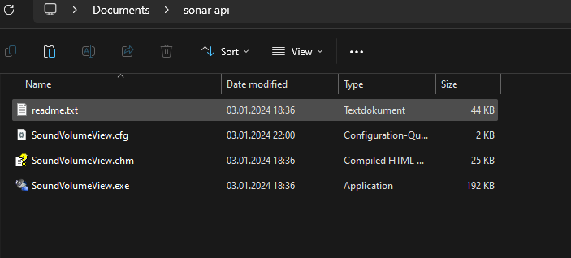
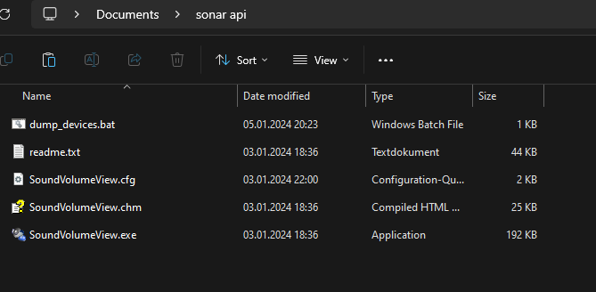
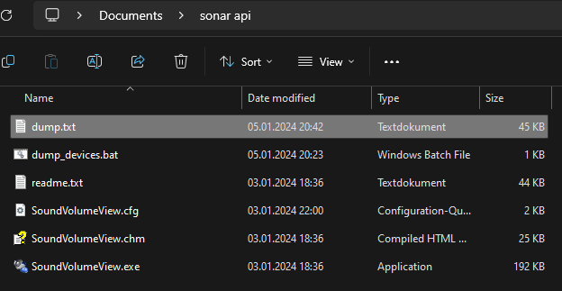
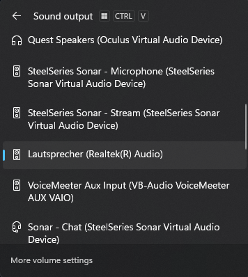
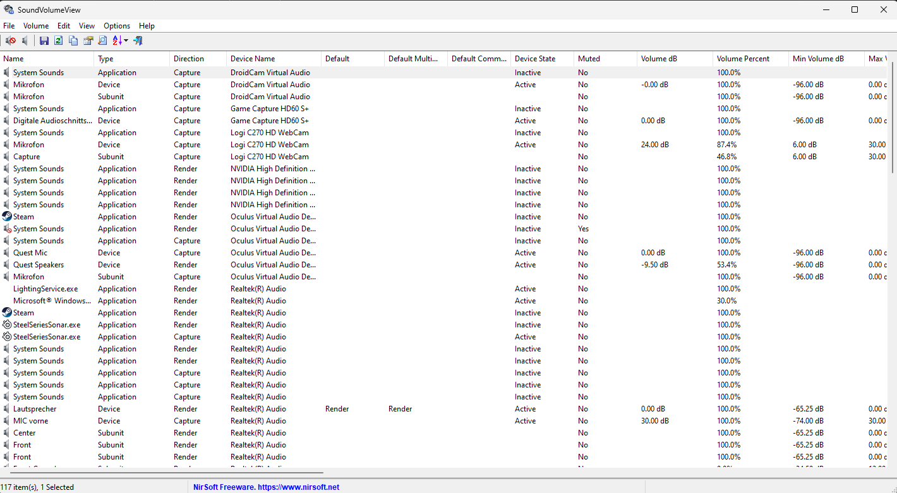

# steelseries-sonar-api

A python api for steelseries' sonar software. An advanced form of <a href="https://github.com/Mark7888/steelseries-sonar-py">Mark7888's sonar api<a> including the possibility to change audio devices and use a hardware controller to interface with sonar.

## IMPORTANT 
This will ONLY work with streamer (for now) because I use streamer mode.

## Installation 
1. Create a new folder anywhere you want, it will later be filled with all the files.
2. Download Nirsoft's SoundVolumeView from <a href="https://www.nirsoft.net/utils/soundvolumeview-x64.zip">here<a> and place it into your folder. It should now look something like this:

   
4. Download this repo and unpack it somewhere else than this folder.
5. Copy the file 'dump_devices.bat' into the folder, like this:

   
7. Verify everything is working by running the file from step 4, it should create a new file called 'dump.txt':

   

## Configuration 

### Primary audio device
1. Open the windows 'Sound output' menu (CTRL+WIN+V) and check for the device you want to use. For me it would be 'Lautsprecher (Realtek(R) Audio)', note this.

   
3. Start SoundVolumeView.exe It will look like this:

   
5. Now check for the first part of your audio devices name ('Lautsprecher'). Look at the one with 'Device' and 'Render' in the following two collumns. The fourth column should include the second part of its name '(Realtek(R) Audio)'. (It is visible in the image from 2. near the bottom)
